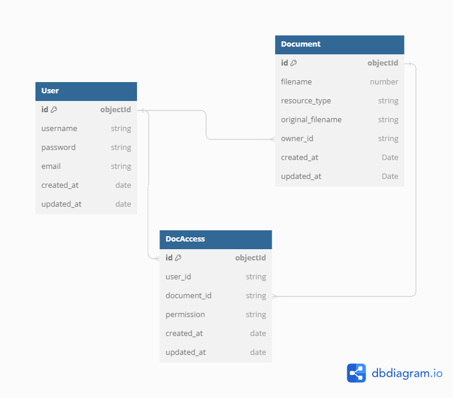
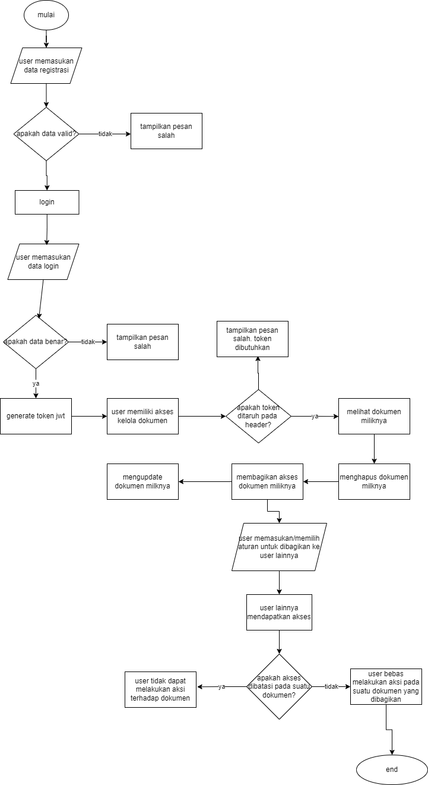

# ISTI-TEST

#### Muhammad Rafly Afrizal Pratama

## Langkah-langkah

1. **Build Docker Image**

Untuk membangun Docker image, jalankan perintah berikut:

```
docker build --no-cache -t isti-test:latest .
```

2. **Jalankan Docker Compose**

Setelah Docker image berhasil dibangun, Anda dapat menjalankan aplikasi dan service-service pendukung lainnya menggunakan Docker Compose:

```
docker-compose up
```

kita bisa menambahkan opsi `-d` digunakan untuk menjalankan container dalam mode detached (background).


## DIAGRAM UNTUK DATABASE 



### Flow App 


## Catatan Penting

- 🔍 Untuk melihat dokumentasi endpoint yang tersedia, Anda dapat mengakses `/api` pada aplikasi yang berjalan.

- ⚠️ **Catatan Cloudinary**: Karena menggunakan akun gratis, jika Anda mengunggah file PDF, hanya gambar yang akan ditampilkan(menjadi format gambar). File PDF tidak dapat diunduh. [Lihat dokumentasi Cloudinary](https://support.cloudinary.com/hc/en-us/articles/360016480179-PDF-or-ZIP-files-appearing-in-Media-Library-but-download-URLs-return-an-error) untuk informasi lebih lanjut.

- Untuk environment variable sengaja langsung ditaruh pada docker-compose

## Informasi Tambahan

- Pastikan Anda berada di direktori yang sama dengan Dockerfile dan file `docker-compose.yml` saat menjalankan perintah-perintah di atas.
- Jika Anda melakukan perubahan pada kode aplikasi atau Dockerfile, Anda perlu membangun ulang Docker image sebelum menjalankan `docker-compose up -d`.
- Untuk menghentikan dan menghapus seluruh container yang dijalankan oleh Docker Compose, Anda dapat menggunakan perintah `docker-compose down`.


Line of Sequence: LN